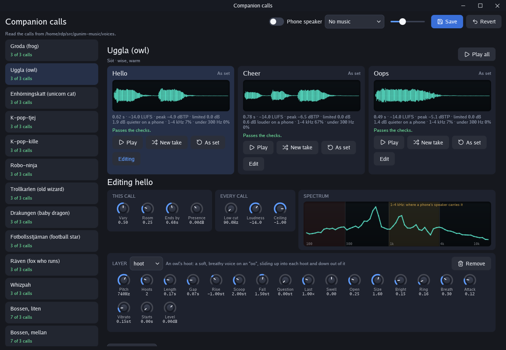
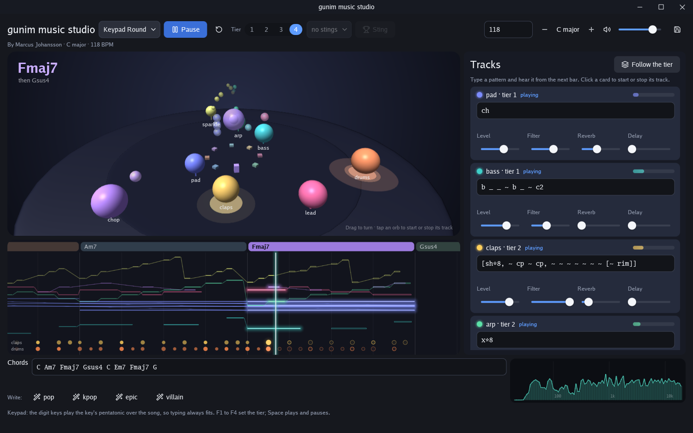
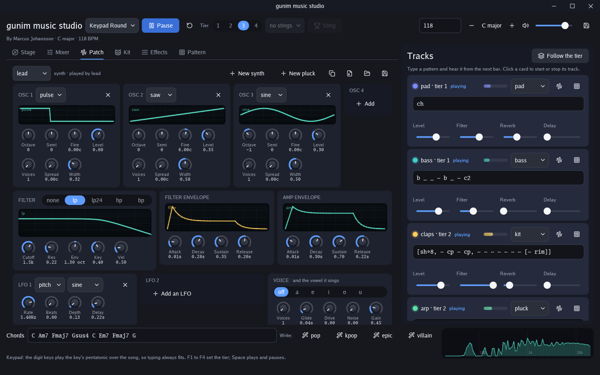
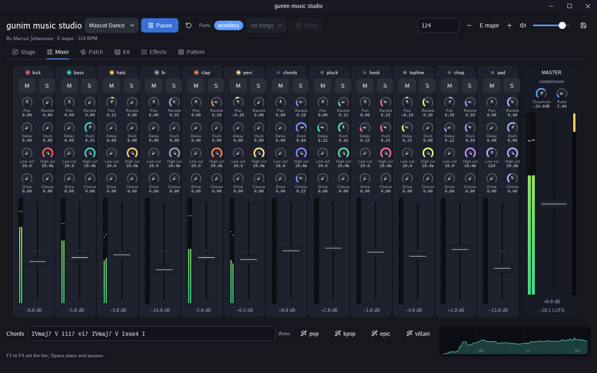
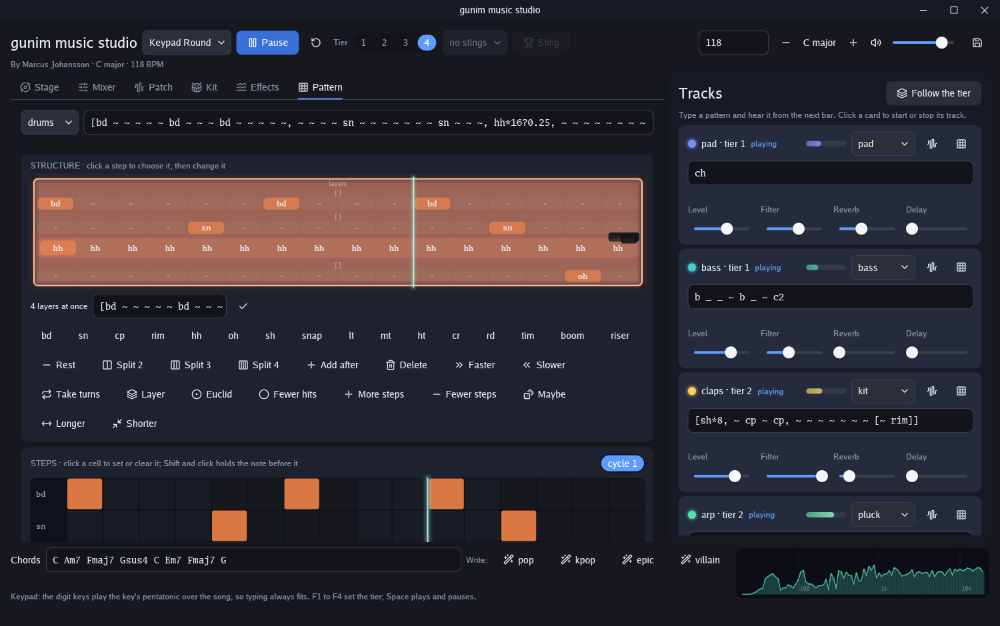

# gunim-game-audio

Sound for games made with [gunim](https://github.com/marrasen/gunim):
songs for its band player, package `audio/band`, the calls a game's
companions make, and the tools to make both. Each song plays without
end, and changes as it goes.

The module was called gunim-music until v0.4.0; its packages are the
same, at the new path:

```go
import music "github.com/marrasen/gunim-game-audio"
```

| Song | Name | What it is |
|---|---|---|
| Greek Themes | `greek-themes` | Ten synths made in Reason at 136 BPM: nine come and go in 16-bar phrases, and a brass solo plays now and then. gunim's candy sudoku plays it. |
| A round song | `a-round-song` | Eight parts made in Reason at 110 BPM, in four tiers that grow with a game's combo: a pad and bass always; light percussion; three melodies; drums and a solo that loops twice, leaves and comes round again. 8-bar phrases. |
| Keypad Round | `keypad-round` | A round song made in code, at 118 BPM in C major, in four tiers: a pad and bass always; claps and a plucked arpeggio; the lead's hook; full drums, a sparkle and a vocal chop. A riser marks each climb. The digit keys play the C major pentatonic over it. |
| Boss Entrance | `boss-entrance` | A cartoon villain's entrance, made in code, at 146 BPM in D minor, in four tiers that rise as the boss's health falls: pizzicato and a tuba; brass stabs and a timpani march; the villain's theme and a choir; drums and string runs. A victory sting of 2 bars ends it. |
| Bubble Bounce | `bubble-bounce` | A bouncy chip tune in the manner of Bubble Bobble, made in code for the Commodore 64's sound, at 150 BPM in F major, in four tiers: a hopping bass and arpeggiated chords; a counter melody and drums; the lead; and its echo and a fuller beat. |
| Sister Dreams | `sister-dreams` | A bittersweet chip tune in the manner of the Giana Sisters' intro, at 132 BPM in D minor: an arpeggio through a sweeping SID filter and a squelching bass always, and a lead, its echo, a pad, drums and wind coming and going. |
| Graveyard Gallop | `graveyard-gallop` | A dark, driving chip tune in the manner of Ghosts'n Goblins, at 148 BPM in E minor, in four tiers: a galloping bass and eerie chord stabs; a march; the lead; and its harmony, toms and ringing bells. A stage-clear sting plays and the song resumes. |
| Pocket Kingdom | `pocket-kingdom` | A sunny chip tune in the manner of Super Mario Land, made in code for the Game Boy's sound, at 144 BPM in G major, in four tiers: a calypso bass on the wave channel and offbeat stabs; drums and a counter melody; the lead; and its echo. |
| Meadow Hop | `meadow-hop` | A shuffling, jazzy chip tune in the manner of Super Mario Bros. 3, for the NES's sound, at 140 BPM in F major, its eighths swung in triplets, in four tiers: a walking triangle bass and two pulses comping each chord's third and seventh; a shuffle beat; the lead's hook and claps; a counter line and fills. |
| Hero's Field | `heros-field` | A heroic march in the manner of The Legend of Zelda, for the NES's sound, at 130 BPM in B flat major, in four tiers: triangle bass and triplet arpeggios; a march; the lead; and its harmony and drums. A treasure fanfare sting plays and the song resumes. |
| Palace Run | `palace-run` | A driving chip tune in the manner of Zelda II's palaces, for the NES's sound, at 160 BPM in A minor, in four tiers: a pumping octave bass and racing arpeggios; drums; the lead; and its harmony and a metallic clank. |
| Underworld Ascent | `underworld-ascent` | A quirky chip tune in the manner of Kid Icarus, for the NES's sound, at 150 BPM in G minor: a bouncing triangle bass and chirps always, and a lead, its harmony, chords and drums coming and going. |
| Mascot Dance | `mascot-dance` | A bright dance groove, made in code, at 124 BPM in E major, for a mascot to dance to. Its tracks come and go by themselves around a kick, a bass and hats that always play, and a topline it writes itself changes every two phrases. |
| Star Drift | `star-drift` | A calm song of space, made in code, at 76 BPM in D Lydian, full of wonder, for Rymden's room and its map: slow pads, a sub and bells ringing always, and twinkles, arpeggios, a choir, a floating lead and a soft heartbeat coming and going. |
| Orbit Round | `orbit-round` | A round song in space, made in code, at 116 BPM in E minor, in four tiers: a pad, a bass and a driving sequencer; claps and bells; a theremin's lead; drums and zaps. The digit keys play the E minor pentatonic over it. |
| Candy Clouds | `candy-clouds` | A calm, sweet song of candy land, made in code, at 84 BPM in F major, for a room and its map: a soft pad, a round bass, a music box and a soft snap always, and a marimba, a celesta's tune, sugar sparkles and a hum coming and going. |
| Compass Rose | `compass-rose` | A calm song of travel, made in code, at 92 BPM in D major, for a room and its map: a fingerpicked guitar, an upright bass, strings and a hand drum always, and a wooden flute's tune, a glockenspiel and the sea's swell coming and going. |
| Summer Meadow | `summer-meadow` | A calm song of a summer meadow, made in code, at 88 BPM in G major, for a room and its map: a plucked harp, a soft pad, a round bass and a woody tick always, and an ocarina's tune, birdsong and a bumblebee's hum coming and going. |
| Tinker Lab | `tinker-lab` | A curious, bouncy song of an inventor's workshop, made in code, at 96 BPM in A major, shuffled in triplets, for a room and its map: plucked strings, a plucked bass, a soft pad, a light groove and a clock's tick-tock always, and a marimba's tune, bubbly blips and a vibraphone coming and going. |
| Tinker Round | `tinker-round` | A round song of the same workshop, made in code, at 112 BPM in A major, shuffled, in four tiers: plucked strings, a plucked bass and a pad; claps and a clock; a marimba's tune; drums and bubbly blips. The digit keys play the A major pentatonic over it. |
| Alien Entrance | `alien-entrance` | An alien boss's entrance, made in code, at 128 BPM in C minor, in four tiers that rise as the boss's health falls: a bass and radar blips; saucer stabs, a march and claps; a theremin's theme, as in a 1950s film, and a choir; drums, string runs and zaps. A victory sting of 2 bars ends it. |
| Sugar Rush | `sugar-rush` | A driving candy-pop song for a lane of battle, made in code, at 150 BPM in A major, in four tiers: a fat pumping synth bass, a pad and hats; a four-on-the-floor kick, claps and supersaw stabs, pumping under it; the hook and sparkly bells; full drums, the hook an octave up too, and glassy sparkles. Its stings: clear, a wave won; tierup; best, a new best; and over, a cartoon sad trombone. Sugar Storm fights to it. |
| Sundae Showdown | `sundae-showdown` | A cartoon villain's boss fight in candy pop, made in code, at 140 BPM in G minor, in four tiers that rise as the boss's health falls: an oom-pah fat synth bass, a creepy-cute music box and a soft kick; a beat and supersaw stabs; claps and the villain's theme, sung on a vowel; full drums, a choir and glassy runs. A victory sting of 2 bars ends it. |
| Candy Lounge | `candy-lounge` | A cozy candy-pop groove, made in code, at 90 BPM in F major, swung, for a game's menu: a soft beat, a warm bass, an electric piano and a pad always, and a music box quoting Sugar Rush's hook, vibes, a glassy topline and a shaker coming and going. |

Try them in the jukebox, a window that plays a song, sets its tier
with buttons or the keys 1 to 4, and shows what each part plays, bar by
bar. Its song picker groups the songs by category, each a submenu.
Autoplay steps a tiered song up a tier each phrase, and from the top
tier back to tier 1. In A round song a click on a part starts it, or
stops it with its outro, at the next phrase, and Follow the tier hands
every part back to the tier:

```sh
go run github.com/marrasen/gunim-game-audio/cmd/jukebox@latest
```

Or listen from the terminal:

```sh
go run github.com/marrasen/gunim-game-audio/cmd/play@latest -list
go run github.com/marrasen/gunim-game-audio/cmd/play@latest -song greek-themes
go run github.com/marrasen/gunim-game-audio/cmd/play@latest -song a-round-song -tier 3
```

Play one in a program, under its other sounds:

```go
mix := audio.NewMixer()
if _, err := speaker.Open(mix, speaker.Options{Name: "My game"}); err != nil {
	return err
}
song, err := music.Song(music.GreekThemes)
if err != nil {
	return err
}
mix.Play(song.Play(seed), audio.Options{Volume: 0.3, FadeIn: 2 * time.Second})
```

Each seed plays a song its own way. A song may offer more than
playing. Each such feature is an interface of package `band` that its
player implements, so a program checks for it. A song with tiers has a
`band.Tiered` player:

```go
p := song.Play(seed)
if t, ok := p.(band.Tiered); ok {
	t.SetTier(tierFor(combo)) // from the next phrase on
}
```

A tier change starts at the next phrase. The parts above the tier
leave with their outros, and those up to it come in with their intros.

A program can also start and stop the parts one by one, over the
tiers. The player is then a `band.Triggered` too:

```go
if t, ok := p.(band.Triggered); ok {
	t.SetPart("drums", band.PartOn)  // in with its intro, at the next phrase
	t.SetPart("bass", band.PartOff)  // out with its outro
	t.SetPart("bass", band.PartAuto) // back to the tier
}
```

A part keeps its control through changes of tier, until `SetPart`
changes it.

## Songs made in code

Keypad Round, Boss Entrance and Mascot Dance are made in code, by package
`synth`: synthesizers play them as they are heard, so they take edits
as they play, and a program can do more with them. Each is a
`*synth.Song`, and its player a `*synth.Player`, which is a
`band.Tiered`, a `band.Triggered` and a `band.Watcher` like the others:

```go
p := song.Play(seed).(*synth.Player)
p.SetTier(tierFor(combo)) // 1 always, 2 from a combo of 2, 3 from 4, 4 from 6
p.Key(digit)              // a note of the key's pentatonic, at once
p.Sting("victory")        // from the next beat, in place of the song
```

The tier changes at the next phrase. Where a song marks its
transitions, a riser plays in the bar before a climb, an impact lands
with it, and a down sweeps as the tier falls. A boss's health maps to
the tier the same way: full health tier 1, and each quarter lost one
tier more.

The keypad plays the pentatonic of the song's key, so a player's typing
always fits the music: in Keypad Round the keys 1 to 9 climb C, D, E,
G, A from C5, and 0 tops them. A song in another key, or transposed,
retunes the keypad with it. A sting plays from the next beat, then
silence, or the song again where the sting resumes it.

`Look` says what plays as it is heard, for visuals that keep time with
the music, such as a mascot's dance: the bar, where it started, how
long it lasts, the chord, and each track's level. Pass the frame heard,
which the voice's position gives:

```go
v := mix.Play(p, audio.Options{})
l := p.Look(audio.Frames(v.Position()))
```

### Dancing and clapping to the music

`music.BeatAt` says where any song of the library is in its beat, as
heard, for characters that dance to it: the bar, the beat in it, how
far through the beat, and when the next beat comes. A song made in code
asks its player, which follows its tempo as it changes; a recorded one
keeps its tempo from its first frame:

```go
heard := audio.Frames(v.Position())
b := music.BeatAt(song, p, heard)
dancer.Bob(b.Beat, b.Phase)  // b.Frame+int64(b.Frames) is the next beat
```

A song made in code also tells of its drums' hits before they sound.
`Hits` gives the hits from a frame up to another, each with the frame
it sounds on and what drum it is, whatever the kit calls it:
`synth.Clap`, `synth.Kick`, `synth.Snare` and so on. It tells of the
bar being made, and foresees the bar after it, so each hit comes with
a bar's warning, two seconds at 120 BPM.

Each song made in code names a sound to clap to, its `Clap`: a clap, as
most do, or any track's notes, as Star Drift's bells. `Claps` tells of
it as `Hits` does, a bar ahead, so a character can raise its hands in
time for its palms to meet on the sound: time for a wind-up, and to
see two claps coming close together and clap twice, quick.

```go
if sp, ok := p.(*synth.Player); ok {
	for _, h := range sp.Claps(nil, heard, heard+audio.SampleRate) {
		dancer.ClapAt(h.Frame) // hands meet on that frame
	}
}
```

A hit is told of on each call until it sounds, so a dancer takes each
once, by its frame. A foreseen hit, its `Foreseen` set, sounds as told,
within a few milliseconds of a human's nudge, unless the song changes
first: at a phrase's start, where a tier changes or a part comes or
goes, or where a sting starts. A tier asked for before the phrase's
last bar is foreseen; a wander song's own choice of parts is not, but a
part the game turns on or off is.

Keypad Round's claps come in at tier 2, and those of the other tiers
songs at tier 3, Orbit Round's, Alien Entrance's and Tinker Round's at
tier 2. Mascot Dance's, Sister Dreams' and Underworld Ascent's come and
go as those songs wander, and the game can hold them in with
`SetPart`; Star Drift's bells always ring, as do Candy Clouds' soft
snap, Compass Rose's rim, Summer Meadow's woody tick and Tinker Lab's
snap, on beats 2 and 4. Pocket Kingdom claps twice, quick, every bar;
Boss Entrance, Bubble Bounce, Hero's Field, Underworld Ascent, Orbit
Round, Alien Entrance, Meadow Hop and Tinker Round every other bar. The recorded songs, Greek Themes and A round song,
tell their beat but not their drums: a character can clap on beats 2
and 4 to them.

The engine makes a second of the busiest song, all twelve of Mascot
Dance's tracks at once, in about 35 ms on one core of a 2015 desktop
CPU, about 28 times faster than it plays.

## Companion calls

The library also holds the calls of Läxkompis's ten companions: a
hello when a child taps one, a cheer for a level done, and an oops for a
wrong answer. They are made in code, by package `calls`, from models of
how the sounds are made:

| Model | What it makes | Who uses it |
|---|---|---|
| `hoot` | an owl's breathy "hoo", sliding up into each hoot | the owl |
| `ribbit` | a frog's "rib-bit", rolled by its throat, its throat sac ringing | the frog, the meadow's frog |
| `blub` | a gulp: a lip's pop, a falling "blub", and rising bubbles | the frog, Biologi's germs, Labbet's slimes, bubbles and drops |
| `mew` | a kitten's "m-i-a-u", its pitch arching, rolled into a trill if asked | the unicorn cat |
| `sing` | a sung phrase: a syllable, "la", "oh", "yeah", "hey", "ooh", "na", "ah" or "ha", on each of up to four notes, with vibrato | the two K-pop singers, the wizard, the football star's "hey!", Whizpah's laugh |
| `beeps`, `whirr`, `glitch` | a robot's beeps, a servo's whirr, and a stuttering, falling "bwoo" | the robot ninja, the meadow's birds and bumblebee, Labbet's crank |
| `sparkle`, `chime` | small bells climbing a pentatonic scale, and notes struck on a celesta, as a "ta-da" | the wizard, the unicorn cat, Labbet's lamp |
| `whoosh`, `puff`, `fizzle` | air rushing past, a burst of smoke or flame, and crackles thinning over a hiss | the wizard, the dragon, the fox, Labbet's splash, fizz and spark |
| `roar` | a small creature's rough "rawr", ending in a squeak if asked | the baby dragon |
| `yip` | a fox's short, bright yip, rising at its end as a question if asked | the fox, the dragon's hiccup |
| `whistle`, `crowd`, `bonk` | a referee's pea whistle, a small crowd's "yay" or "ooh" with claps, and a ball's hollow knock | the football star, Labbet's magnet and pendulum |
| `theremin` | a theremin's voice, nearly pure, sliding from note to note under a wide vibrato | the aliens, Labbet's spring |
| `hum`, `rumble` | a flying saucer's beating, pulsing hum, and a rocket's rumble with its jet rising | Rymden's effects, the meadow's bumblebee |

An eleventh companion hides at the end of the list: Whizpah, a giggling
gremlin named for the one who made the wizard old, who laughs at
everything on the sung "ha". Its hello flies in with a "whizz-pHA!", its
cheer is a cackle that runs down and then up an octave into a squeaky
"HAAA", and its oops is a nervous "heh-heh-heh… huh?".

The game's bosses have calls of their own, seven each: a taunt, a roar,
a hurt "oof!", a laugh at a wrong answer, a worried "uh-oh", a defeated
"nooo" and a dizzy whimper. The candy bosses are small, middle and big,
and so are Rymden's aliens: a squeaky little one of theremin warbles
and a giggle, a show-off with a robot's voice, and a deep, wobbly big
one. A layer's `Ring` ring-modulates it, as a robot's voice is made.
Biologi's germs, `bacill-liten`, `bacill-mellan` and `bacill-stor`, are
small, middle and big too: a squeaky one whose giggle pops like
bubbles, a fizzy, gurgling show-off, and a deep, wobbly "blobb" with a
gloopy laugh. Each squishes into a burst of bubbles as it falls.
Labbet's slimes, `slemmis-liten`, `slemmis-mellan` and `slemmis-stor`,
blobs escaped from their test tubes, are small, middle and big as well,
and speak in gloops: each syllable a voiced "blub", a giggle with a
gloop on every "ha", a wobbling "oo-ooh", and a splat for a hurt. As it
falls each melts into a puddle, its gloops running down into thinning
bubbles.

Rymden is a set of effects rather than a character: a whoosh into
space, a rocket's launch, a shooting star, a saucer's hum and a soft
"bliip" for a planet tapped, each called by its name. The saucer's hum
is a loop, a call with a `Loop`, made so its end runs on into its start
without a seam; the game starts it as the saucer comes and stops it as
it goes:

```go
voices.Play("rymden", "launch", audio.Options{})
voices.Start("rymden", "ufo", audio.Options{}) // hums till Stop
voices.Stop("rymden", "ufo", 0)                // fades out
```

Biologi, a summer meadow, is another set of effects: `vind`, a soft
breeze with a few birds, for flying in; `fagel`, a bird's chirp;
`groda`, the frog's ribbit; `bubbla`, a germ popping into bubbles as
it falls; and `humla`, a bumblebee buzzing by.

Labbet, an inventor's workshop, is a third, for the game to play as a
thing it shows happens: `blubb`, bubbles rising as a thing floats up;
`plask`, a splash and a bloop as it sinks; `fizz`, a tablet fizzing as
it dissolves; `klonk`, a magnet's zip and clank on metal; `zap`, a soft
spark of static; `pling`, a switch's click and a lamp's ding; `droppe`,
a water drop; `eko`, a sung "hal-lå!" and its echoes; `vind`, a puff of
air; `tick`, a pendulum's tick-tock with a creak; `boing`, a spring; and
`vev`, a little crank whirring up and down.

The voices are made as a throat makes them: a buzz of every harmonic
of a pitch, and breath, shaped by the mouth's resonances into a vowel
that moves through the call. A call layers models, each at a time and
a level of its own: the unicorn cat's hello is a mew with a sparkle
after it.

Each call is made anew each time it plays, a take of its own, so a
child tapping a companion again and again never hears the same sound
twice. A player makes takes ahead, in the background, so each plays at
once:

```go
lib, err := music.Calls()
if err != nil {
	return err
}
voices := calls.NewPlayer(mix, lib)
voices.Warm()                                       // make takes ahead
voices.Play("uggla", calls.Hello, audio.Options{})  // a new take each time
voices.PlayTake("uggla", calls.Oops, 0, audio.Options{}) // the call as set
```

Every call is finished the same way: cut gently under 90 Hz, where
there is only rumble, started from its first millisecond, brought to
−14 LUFS at its loudest, and held under −1 dBTP. The tests check every
call, as set and in 20 takes: its length, 0.3 to 0.7 s, or up to 1.2 s
for a cheer; its loudness and peak; that it sounds at once; and that a
phone's speaker, which plays little under about 700 Hz, takes no more
than 6 dB from it, so it still carries on a phone.

### Setting the calls by ear

The calls window plays each companion's calls, draws them, and
measures them against the brief, with a knob for each number of the
models that make them:

```sh
go run ./cmd/calls
```



A call plays as a knob is let go. New take plays another take, as the
game makes one each time; As set plays the call as its knobs set it.
Vary sets how far the takes stray, and Room how much of a small room is
heard round the call. Presence lifts a call about 2.2 kHz, where a
phone's speaker carries it, and Ends by fades out a call whose bells
would ring past the length the brief allows. Phone speaker plays the calls as a phone's speaker
does, and a song can play under them, as in the game. A call can have
more than one layer, each a model, at a time and a level of its own.

Save writes the companion to `voices/<id>.json`. Each call there has its
Notes, which the window's notes box sets: write what should change, and
save, for the next round of the call.

`-render` writes every call to a WAV file instead, mono, 24 bits at 48
kHz, as the brief names them, and says how each measures:

```sh
go run ./cmd/calls -render out
go run ./cmd/calls -render out -seed 7   # take 7
```

## gunim music studio

The studio is a window to make game music in, with the engine playing
as you work:

```sh
go run github.com/marrasen/gunim-game-audio/cmd/studio@latest
```



The stage shows the song in 3D. Each track is an orb on the ring of its
tier, tier 1 innermost, swelling as the track grows loud. Each note
flies from its orb to the core as a spark, high or low by its pitch, so
an arpeggio climbs and falls in the air. Each drum ripples on the floor.
The chords stand round the core, the one heard raised and lit. A drag
turns the stage, and a tap on an orb starts or stops its track at the
next phrase.

Under the stage the notes flow past the line where they are heard: each
track's notes in its colour, joined so an arpeggio shows its shape, the
drums in lanes under them, and the chords above. The notes of the bar
to come show as outlines before they sound.

The tabs over the stage swap it for the editors, each heard as it is
changed, with no file to edit and nothing to reload:

- **Mixer.** A strip for each track, with mute and solo, knobs for its
  pan, its reverb and delay sends, its sidechain duck, its low and high
  cut, its drive and its chorus, a stereo meter, and its fader. The
  master's strip has the mix's meter, its fader, its compressor with a
  bar of how far it turns the mix down, and its loudness in LUFS. The
  track panel slides away to give the desk the window's width.
- **Patch.** A synth's oscillators, up to four, each with its wave drawn
  (a click on it turns to the next wave), its octave, tuning, level,
  unison voices and spread, and its pulse width or FM ratio and index;
  its filter with its response drawn; its filter and amp envelopes,
  drawn; two LFOs; its voices, glide, drive, noise and the vowel it
  sings. A plucked string's decay, brightness and body. Under them a
  note of the patch drawn whole and close up, the track playing it on a
  scope as it plays, and a keyboard that plays it over the song.
- **Kit.** A kit's drums as pads, which light as the song hits them and
  play as they are pressed, and the drum chosen: its type, tune, decay,
  tone, level and pan, and its hit drawn.
- **Effects.** The reverb with its tail drawn, the delay with its
  echoes, the compressor with its curve and where the mix sits on it,
  the master level, the swing, the sidechain's track, and the tier
  changes' riser and impact.
- **Pattern.** A track's pattern by sight. Its structure is drawn as
  boxes in boxes: a sequence splits its box by its steps' shares,
  layers and turns stack, the turn playing lit, and a repeat, a
  Euclidean rhythm or a maybe marks its box. Click a step, then set it
  from the palette or change it: split it, add one after it, delete
  it, make it faster or slower, make it take turns or add a layer,
  spread it Euclid's way, play it half the time, or give it a bigger
  share. Under it the pattern on a grid of steps, a row a drum or a
  note, where a click sets or clears a cell and Shift and a click holds
  the note before it. Each change writes the pattern back as text.

Patches and kits save to a file of their own, a `.patch.json`, and load
from one, in place of a patch or as a new one; a new synth, pluck or kit
starts from a sound that plays, and a copy starts from another. A
track's card picks the patch it plays, and its two buttons open its
patch and its pattern in the editors.





Each track's card takes a new pattern as it is typed, heard from the
next bar; a pattern that does not play says why, and the old one plays
on. Its sliders set its level, its filter and what it sends to the
reverb and the delay, heard at once. The chords take a new progression
as it is typed, as `Am F C G` or `vi IV I V`, or write one in a style:
pop, kpop, epic or villain. The tier, the stings, the tempo and the key
change as it plays. The digit keys play the keypad, F1 to F4 set the
tier, and Space plays and pauses. Save writes the song as a song.json.

## Adding a song

Each song is a folder in `songs/`, named for the song, with its parts
and a `song.json`. Its `Kind` says what plays it: `wander` is a
`band.Wander`, whose parts come and go in phrases, and `tiers` a
`band.Tiers`, whose parts play in tiers. Its `Category` is the group
the song shows in, in the tools' song pickers, and `music.Category`
gives it: Boss fights, Calm rooms, Combo rounds, Grooves or Retro chip
tunes so far.

```json
{
	"Kind": "wander",
	"Title": "Greek Themes",
	"Category": "Grooves",
	"Artist": "Marcus Johansson",
	"BPM": 136,
	"BeatsPerBar": 4,
	"PhraseBars": 16
}
```

A tiers song's `song.json` also gives each part its tier, and `Loops`
for a part that loops that many times, leaves with its outro and comes
in again at the phrase after, as a solo does:

```json
	"Parts": {
		"bass": {"Tier": 1},
		"drums": {"Tier": 4},
		"solo": {"Tier": 4, "Loops": 2}
	}
```

The parts are Ogg Vorbis at 48 kHz, named for the instrument and
the piece: `blade-intro.ogg`, `blade-loop.ogg` and `blade-outro.ogg`,
or `greek-power-brass-solo.ogg` for a solo. The intro is the first
phrase, the loop the second, and the outro the rest. `encode.sh` cuts
them from the bounces, one WAV an instrument from bar 1, with ffmpeg,
reading the tempo and the phrase from the folder's `song.json`. A
number in front of a bounce's name, as in `01. Bass.wav`, is dropped:

```sh
./encode.sh ~/bounce_music songs/greek-themes
```

Then add the song's name as a constant in `music.go`, and a row above.
The tests check that every song loads, plays, and has its parts cut at
its bars.

### A song made in code

A song made in code is all in its `song.json`, of kind `synth`, with no
recordings: its key and chords, its patches, and its tracks. The studio
saves one. This is a shortened Keypad Round:

```json
{
	"Kind": "synth",
	"Title": "Keypad Round",
	"Artist": "Marcus Johansson",
	"BPM": 118,
	"Key": "C",
	"Scale": "major",
	"Chords": ["C", "Am7", "Fmaj7", "Gsus4"],
	"Mode": "tiers",
	"Keypad": {"Patch": "marimba"},
	"Patches": {
		"pad": {
			"Osc": [{"Wave": "saw", "Unison": 5, "Spread": 22}],
			"Filter": {"Type": "lp", "Cutoff": 1100, "Res": 0.12},
			"Amp": {"Attack": 0.7, "Decay": 1.2, "Sustain": 0.85, "Release": 1.4}
		},
		"kit": {"Kind": "drums"}
	},
	"Tracks": [
		{"Name": "pad", "Tier": 1, "Patch": "pad", "Pattern": "ch", "Reverb": 0.4},
		{"Name": "drums", "Tier": 4, "Patch": "kit", "Pattern": "[bd ~ ~ bd, ~ sn, hh*8]"}
	]
}
```

A track's pattern is TidalCycles' mini-notation over a bar, or over
`Bars` bars:

| Pattern | Plays |
|---|---|
| `bd ~ sn ~` | four steps, two of them rests |
| `[0 2]*2 4` | a step of two, twice, and one more |
| `<0 2 4>` | one of them each bar, in turn |
| `bd(3,8)` | three hits over eight steps, Euclid's way |
| `hh*16?` | sixteen hats, each left out half the time |
| `0 _ 2@2` | a step held for two, and one weighing two |
| `[bd, hh*4]` | both at once |

A note is a degree of the scale, as `0` for the root or `4#`; a chord
tone, as `c0`, `c1`, `c2`; `ch` for the whole chord, voiced near the
last; `b` for its bass; `x` for the next note of an arpeggio; or a note
by name, as `C4`. Each `'` after a note lifts it an octave. A drums
patch plays drums by name: `bd`, `sn`, `cp`, `hh`, `oh`, `rim`, `lt`,
`mt`, `ht`, `cr`, `rd`, `sh`, `snap`, `tim`, a timpani tuned to the
chord, and the effects `boom`, `riser` and `down`.

The SID patches sound like a Commodore 64. An oscillator's `Wave` may be
`noise`, pitched by the note as the SID's noise is, or a combined wave,
`sawtri`, `pulsetri` or `pulsesaw`, two waves ANDed as the chip makes
them; `Sync` restarts an oscillator with the cycles of the one before it,
and `Ring` turns it over with that one's half cycles. A filter of type
`sidlp`, `sidbp`, `sidhp` or `sidnotch` is the SID's: 12 dB an octave,
driven, its resonance rough. A patch's `Arpeggio` plays a chord as one
voice, its notes in turn 50 times a second, as C64 tunes do: `{"Chord":
true}` plays a track's `ch` so, and `Steps` step through semitones. The
drums `sbd`, `ssn`, `scp`, `shh`, `soh`, `stom` and `szap` are the SID's,
built a frame at a time, a burst of noise and a falling tone, and a kit
may give any name one of their types: `sidkick`, `sidsnare`, `sidclap`,
`sidhat`, `sidohat`, `sidtom` or `sidzap`.

The Nintendo patches sound like a NES or a Game Boy. `nespulse` is a
pulse snapped to the chips' widths of 12.5, 25, 50 and 75%; `nestri` the
NES's stepped triangle; `nesnoise` and `nesmetal` its noise, in its long
mode and its short, metallic one; and `gbwave` the Game Boy's wave
channel, playing an oscillator's `Table` of 32 steps of 0 to 15, which
the studio's patch editor lets you draw. A patch's `Chip` steps its
level as a console does, `{"Levels": 16, "Hz": 60}`, and its `Bend`
slides each note in from off its pitch, `{"Semis": 12, "Time": 0.05}`.
The drums `nbd`, `nsn`, `ncp`, `nhh`, `noh`, `ntom` and `nclk` are the
NES's, 60 frames a second: a triangle's falling kick and tom, the
noise's snare, its clap in bursts, as the console's games made one, and
its hats, and a metallic click, as the types `neskick`, `nessnare`,
`nesclap`, `neshat`, `nesohat`, `nestom` and `nesmetal`.

A track's `Params` change each note, as TidalCycles' controls do: `vel`,
`pan`, `cutoff`, `res`, `legato`, `octave`, `vowel` and `tune`, each a
pattern of values, or a signal from lo to hi as `sine:400:2000:4`. Its
mix is `Gain`, `Pan`, `Reverb`, `Delay`, a sidechain `Duck` to the
song's kick, and the effects `HPF`, `LPF`, `Shape`, `Crush`, `Coarse`
and `Chorus`.

`cmd/render` renders a song made in code to a WAV file and says how loud
each tier is, and each track alone, octave by octave, for mixing without
a speaker:

```sh
go run ./cmd/render -song boss-entrance -o boss.wav -tracks -bands
```

## Licence

The songs, in `songs/`, are © 2026 Marcus Johansson, but for Candy
Clouds, Compass Rose, Summer Meadow, Tinker Lab and Tinker Round, © 2026
Mikael Lönebrink, all under the [Creative Commons Attribution
4.0](LICENSE-music) licence: use them, change them and share them, in
anything, and credit the song's maker, as its song.json names them.

The Go code is under the [Apache License 2.0](LICENSE), as gunim is.
